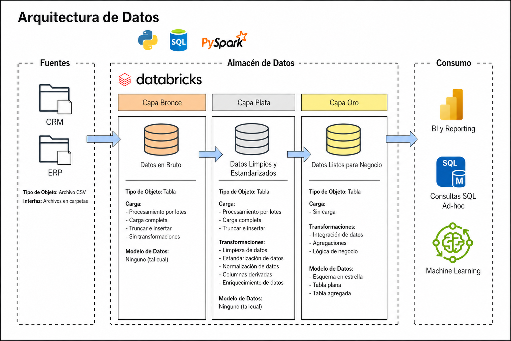

# Data Warehouse con Arquitectura Medallion en Databricks

Proyecto final de ingeniería de datos que implementa un Data Warehouse completo sobre **Databricks** utilizando la **Arquitectura Medallion** (Bronze → Silver → Gold). Se integran datos de dos sistemas de origen (CRM y ERP) para construir un modelo dimensional listo para análisis y reportes.

---

## Arquitectura



El proyecto sigue el patrón Medallion de tres capas:

| Capa | Esquema | Descripción |
|------|---------|-------------|
| **Bronze** | `bronze` | Datos crudos ingestados tal cual desde los archivos CSV de origen. Sin transformaciones. |
| **Silver** | `silver` | Datos limpios, estandarizados y validados. Incluye limpieza de duplicados, normalización y enriquecimiento. |
| **Gold** | `gold` | Modelo dimensional listo para consumo: dimensiones y tabla de hechos para BI y análisis. |

---

## Fuentes de Datos

Los datos provienen de dos sistemas de origen en formato CSV:

### CRM (Customer Relationship Management)

| Archivo | Registros | Descripción |
|---------|-----------|-------------|
| `crm_cust_info.csv` | ~18,493 | Información de clientes (nombre, estado civil, género, fecha de alta) |
| `crm_prd_info.csv` | ~397 | Catálogo de productos (nombre, costo, línea, vigencia) |
| `crm_sales_details.csv` | ~60,398 | Detalle de órdenes de venta (fechas, cantidades, precios) |

### ERP (Enterprise Resource Planning)

| Archivo | Registros | Descripción |
|---------|-----------|-------------|
| `erp_CUST_AZ12.csv` | ~18,483 | Datos complementarios de clientes (fecha de nacimiento, género) |
| `erp_LOC_A101.csv` | ~18,484 | Ubicación de clientes por país |
| `erp_PX_CAT_G1V2.csv` | ~36 | Categorías y subcategorías de productos |

---

## Estructura del Proyecto

```
├── data/                          # Archivos CSV de origen
│   ├── crm_cust_info.csv
│   ├── crm_prd_info.csv
│   ├── crm_sales_details.csv
│   ├── erp_CUST_AZ12.csv
│   ├── erp_LOC_A101.csv
│   └── erp_PX_CAT_G1V2.csv
│
├── documentacion/
│   └── arquitectura.png           # Diagrama de arquitectura
│
├── exploracion/
│   └── 04_data_exploration.ipynb  # Análisis exploratorio para diseño de Silver
│
└── pipelines/
    ├── setup/
    │   └── 01_create_schema.ipynb # Creación de esquemas Bronze, Silver y Gold
    ├── bronze/
    │   ├── 02_ddl_bronze.ipynb    # DDL: creación de tablas Bronze
    │   └── 03_load_bronze.ipynb   # Carga de CSV a tablas Delta Bronze
    ├── silver/
    │   ├── 05_ddl_silver.ipynb    # DDL: creación de tablas Silver
    │   └── 06_load_silver.ipynb   # Transformaciones y carga a Silver
    └── gold/
        └── 07_load_gold.ipynb     # Creación de vistas dimensionales en Gold
```

---

## Orden de Ejecución

Los notebooks deben ejecutarse en el siguiente orden:

```
01_create_schema   →   02_ddl_bronze   →   03_load_bronze
                                                  ↓
                                          05_ddl_silver
                                                  ↓
                                          06_load_silver
                                                  ↓
                                          07_load_gold
```

> El notebook `04_data_exploration.ipynb` es opcional y se utiliza para analizar los datos de Bronze antes de diseñar las transformaciones de Silver.

---

## Transformaciones por Capa

### Bronze
- Ingesta directa de CSV sin modificaciones.
- Carga completa con truncado previo (`Truncate & Insert`).
- Tipo de carga: **Batch / Full Load**.

### Silver
Por cada tabla se aplican las siguientes validaciones y transformaciones:

- **Llaves primarias**: eliminación de duplicados y nulos (conservando el registro más reciente).
- **Espacios no deseados**: `TRIM` en columnas de texto.
- **Estandarización**: códigos abreviados expandidos a valores descriptivos (ej. `M` → `Married`, `F` → `Female`).
- **Normalización de fechas**: conversión de enteros a tipo `DATE`.
- **Integridad de datos**: corrección de ventas donde `sales ≠ quantity × price`.
- **Enriquecimiento**: generación de columnas derivadas (`cat_id`, `prd_key` compatible) para facilitar joins entre tablas.
- **Columna de auditoría**: `dwh_create_date` con marca de tiempo de carga ETL.

### Gold
Modelo dimensional **Star Schema** con:

| Objeto | Tipo | Descripción |
|--------|------|-------------|
| `gold.dim_customer` | Vista | Dimensión de clientes con datos integrados de CRM y ERP (país, género, fecha de nacimiento) |
| `gold.dim_product` | Vista | Dimensión de productos con categoría y subcategoría integradas |
| `gold.fact_sales` | Vista | Tabla de hechos de ventas con llaves sustitutas hacia dimensiones |

#### Modelo Dimensional

```
dim_customer          fact_sales           dim_product
─────────────         ──────────────       ─────────────
customer_key ◄──── customer_key       ┌── product_key
customer_id          product_key ────►┘   product_id
customer_number      order_number         product_number
first_name           order_date           product_name
last_name            shipping_date        category
country              due_date             subcategory
marital_status       sales_amount         cost
gender               quantity             product_line
birthdate            price                start_date
create_date
```

---

## Tecnologías Utilizadas

| Tecnología | Uso |
|------------|-----|
| **Databricks** | Plataforma de procesamiento y orquestación |
| **Apache Spark / PySpark** | Procesamiento distribuido de datos |
| **Delta Lake** | Formato de almacenamiento para tablas Bronze y Silver |
| **SQL (Databricks SQL)** | Transformaciones, validaciones y DDL |
| **Python** | Ingesta de datos en capa Bronze |

---

## Prerrequisitos

1. Workspace de **Databricks** activo con acceso a un cluster.
2. Volumen configurado en Unity Catalog con los archivos CSV bajo la ruta:
   ```
   /Volumes/workspace/default/data-warehouse-databricks/
   ```
3. Permisos para crear esquemas (`CREATE SCHEMA`) en el catálogo `workspace`.
